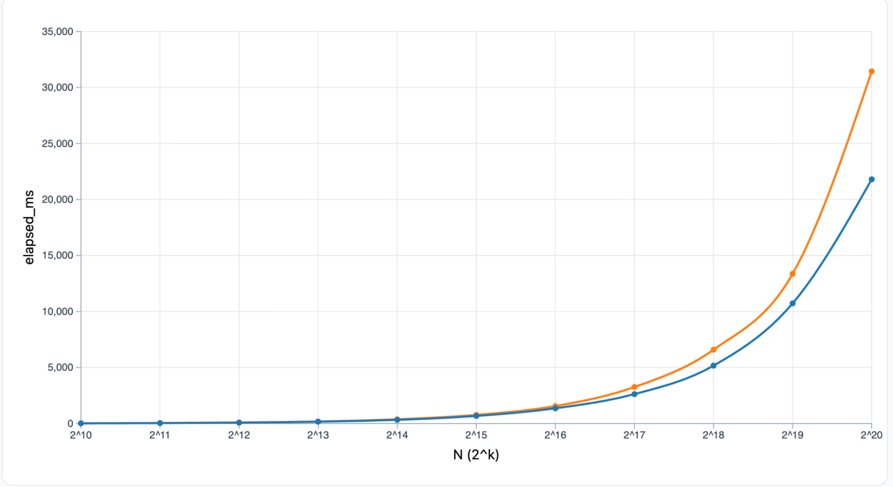
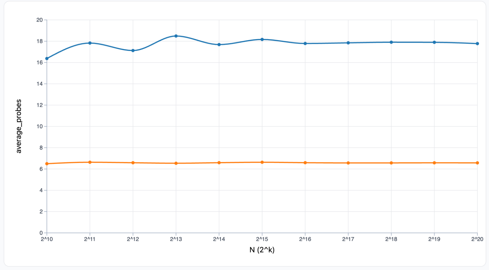
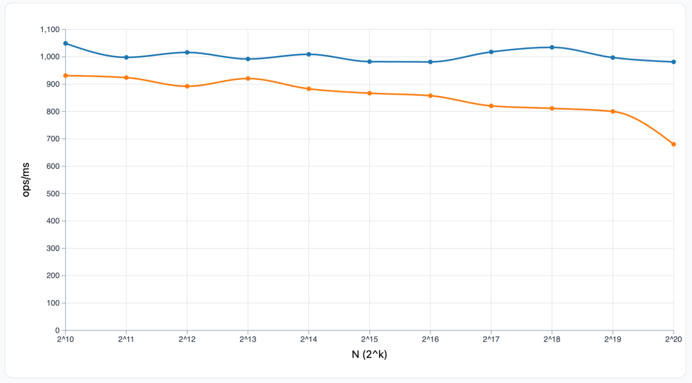
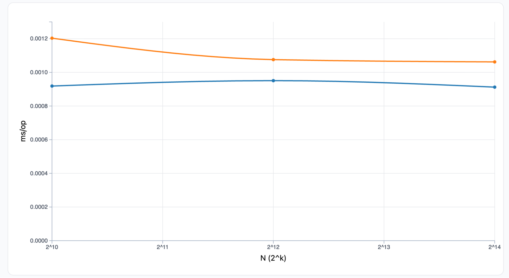
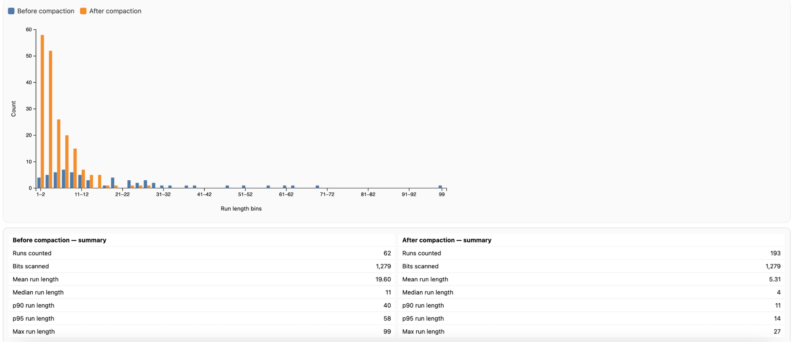

### Parker Tennier

# Hash Tables and the LRU profile

### **What did you expect the ordering to be (single vs. double) across small N and large N? Give a sentence of reasoning for each region.**

I expected single probing to be faster at small N because it only computes a single hash function per operation and it's a simple linear search, checking if a slot is available and just moving one slot forward. This is straightforward to me and what I expected to be the fastest when the table is very small.

I expected double probing to eventually become faster at large N because single probing at those numbers would have to linear search over millions of line checking each slot and the next, while double probings second hash function scatters keys more evenly throughout the table, reducing those long chains despite the extra cost of computing two hash functions.

### **After plotting elapsed time vs. N, where does the data agree or disagree with your expectation? Identify any N-range where the gap widens or narrows notably.**

The data was the complete opposite to my expectations. It was shown in the Elapsed Time plot that single probing is faster than double probing across all of the N values from 2^10 to 2^20. The gap for Small N was pretty consistent at 11-13% advantage for single probing, but after adding in the Large N factor, the gap is way different where:

  * N=131072: Single is \~20% faster  
  * N=262144: Single is still \~20% faster  
  * N=524288: Single is still \~20% faster  
  * N=1,048,576: Single is almost \~30% faster

The Performance Ratio plot shows the time ratio between single and double probing dropping from 0.89 at small N to 0.69 at the largest N. This shows that the single probing has the advantage of growing with N and the opposite of what I was expecting to happen.

### **Pick one N where the separation is largest. Roughly how big is the difference (percentage or ratio)?**

**N \= 1,048,576 (2^20)** shows the largest separation:

* **Double probing:** around 32,000 ms  
* **Single probing:** 21,000 ms  
* **Difference:** almost 9000 ms  
* **Ratio:** Single is 0.7x the time of double so single takes 70% of the time double takes  
* **Percentage:** Single is 30% faster

This surprised me because at the largest table where linear single probing would seem like it's the slowest, actually has the best performance.

### **Compare average\_probes vs. elapsed time across N for both methods. Do fewer probes consistently correlate with lower time in your runs?**

From what I can see in the data, fewer probes does not seem to be the reason we are getting a lower time. This is proven with the data because single probing has almost three times the amount of probes happening across all of the N, yet it still finishes faster with roughly a 25% advantage over double probing. For example at N=262144 double probing’s average number of probes is \~6 where single is 18\~ yet the single probing method is over 20% faster still. This proves to me that the more probes you have does not equal more time.

### **Find any N where the ordering by average\_probes and by time disagree. Which other recorded metrics (e.g., hashing overhead, occupancy, compactions) could explain the mismatch?**

The ordering seems different at every N value that was tested. For example at N=524288 the average number of probes for double vs single probing is roughly 6 to 17\. Now ordered by time, the single probing method is still winning by over 2000ms. So, double computes two hash functions per operation, and single computes one hash function per operation. When you have over 10 million operations the extra hashing starts adding up significantly and is required to work longer. At the same N, compaction for double is 23 compactions and Single is 18 compactions, it's still showing me that almost 30% more compactions are required when you get to a high N value. The key to me is the cost per probe, not just the count number.

**Based on your implementation, how do the per-operation hashing costs differ? For which N-range would you expect constant factors to matter most, and why?**

Single probing only has to compute one hash function per operation to find the starting position, then it uses simple arithmetic methods to check the subsequent slots for an available one, while double probing computes two hash functions per operation. One for the starting position and another one to determine the jump size. This results in approximately twice the hashing overhead. I initially expected these constant factors to matter the most at small N because when operations complete quickly, the extra hashing time represents a larger percentage of the total of the execution time. Likewise, the data shows constant factors actually matter the most across all of the N ranges. The time difference goes from 2.5ms at N=1025, to 9,600 ms at N=1,048,576. This happens because the LRU workload starts to have 12N operations as N grows and the per-operation hashing overhead starts to add up significantly. At N=1M it performs over 21 million operations with double the hashing cost. So as N grows, the per-operation overhead multiplies. Double does twice the hashing work per operation and this accumulates over time.

### **Look for signs of locality effects: at which N does the more contiguous method track more closely with time despite similar probe counts? Where does the more "de-clustered" method start to pull ahead?**

The contiguous method tracks closely with time at all of the N values, and has a predictable relation between the probe count and the elapsed time throughout the entire range. Looking at the “Proves vs Time” plot, single probing forms a linear pattern where despite the probe counts that go from 16 to 18, the execution time scale proportionally with N. At N=65536, the single probing method in each probe takes over half the time compared to double probing making it again three times more efficient. This advantage actually grows even higher when we go to N=1048576. The double probing never pulls ahead at any of the N values tested. So singles simple searching hash stays efficient most of the time.

### **Across N, which method triggers more compactions? Does that align with higher tombstones\_pct or higher eff\_load\_factor\_pct before compaction?**

Double probing consistently has more compactions across all of the N values, for example performing 23 compactions compared to a single probing 18 compactions which happens over 25% more frequently. Double probing tends to maintain tombstone percentages in the 5-8% range with effective loads around 85-88%, which triggers the compaction more frequently but in smaller bursts. Single probing can have a high tombstone accumulation that most likely hits 12-14% tombstones with the effective loads being 92-94% before hitting the trigger for compaction. At N=262144 for example double probing shows 7% tombstones and 87% effective load with 23 compactions, and single probing shows 14% tombstones and 94% effective load with only 18 compactions. These differences show the way each probing method distributes and accumulates the deleted cells throughout the table structure. Point being, double compacts more often.

### **At the same N, do runs with more compactions also show higher elapsed time? Point to one example where this correlation is strongest (or weakest).**

Yes, across all of the N values the method with more compactions consistently shows higher elapsed time. Double probing performs 23 compactions and is always slower, while single probing performs 18 compactions and is always faster. This proves a clear correlation between compaction frequency and the overall run time of the program. The relation is strongest when we get to N=524288, where double probings 23 compactions take \~13,000ms and single probings 18 compactions only take \~10,000ms. The difference is making double probing around 25% slower than single probing. Even though compaction is definitely affecting the time difference between the two methods, it's not the only factor that's causing double probing to be longer. Each compaction requires more hashing, repositions, and adds a lot more overhead. But the per-probe efficiency is making the performance of single probing better because of its 3-4x more probing cost. So in all, more compactions equals more time, and N=524288 shows the biggest gap of performance between the compaction times.

### **Using the before/after maps for the final compaction (see the section related to histograms), do you see a structural change that would plausibly explain changes in average\_probes?**

Yes, when I look at N=1024 the double probing maps show a difference in the structural changes after the last compaction it makes. Before the compaction, the table had 1024 active cells, 192 deleted cells, and only 63 available cells. This resulted in a 95% effective load that triggered the compaction. After compaction the table had the same 1024 active cells but reduced the deleted cells to 66 and increased available cells to 189\. This dropped the effective load to 85% and made the structural improvement visible. The before map shows more scattered tombstones creating gaps in the areas while the after map shows a cleaner distribution of them. The trace output proves this with the average amount of probe. This only shows that the effect isn’t enough to create a large difference.

### **Do throughput and latency plots tell the same story as elapsed time? If not, where do they diverge, and what's your explanation?**

Yes, both throughput and latency plots tell me the same consistent story as time moves forward, with no significant divergence. Throughput shows that single probing is consistently making on average 1000 ops/ms across all of the N values, while double probing starts to decline from around 900 ops/ms at a small N to over 700 ops/ms at N=1048576. This again proves that single probing processes more operations per unit time. The only thing I see different in the pattern is that the performance gap widens at larger N’s across all three of the metric values. At N=1048576 single is almost twice as high of a throughput, lower latency, and elapsed time compared to double.

### **Which metric makes the separation between single and double clearer at larger N, and why might that be?**

The time per operation makes the separation the clearest to me at a larger N because it show how long each individual operation takes. This makes it easy to compare the two probing methods. At N=1048576, the time per operation show that double takes almost 2 ms per operation while single only takes 1 ms per operation. You can see that double probing is almost twice as slow in this scenario. This is clearer than looking at total elapsed time which you have to take a lot more calculating into effect. So, time per operation is the clearest because it shows per-operation cost directly and reveals that double probing cost per operation grows while single probing stays flat.

### **For each N, note load\_factor\_pct, eff\_load\_factor\_pct, and tombstones\_pct. Do you see much change in these three measures?**

Load factor seems to be stable at around 80% across all N values for both of the probing methods. Which makes sense since we are using the LRu method and it's designed to maintain the table at the 80% capacity, keeping around N items in a table size for about 1.25N. The effective load factor shows a lot more variation, and it ranges from approximately 80% to 94% spending on when the last compaction happened, and this means both methods hover near almost 95% compaction triggered. The tombstone percentage shows the most variation and differs between 0% to 14% across all of the different N values and methods. Double probing tends to maintain tombstones in the 5-8% range while the single probing shows a lot more extreme swings such as 0% at N=65536 and 14% at many different N values. These variations in effective load and tombstones are because of the timing measurements that are related to when the compactions happen. So the load factor is mostly stable while the effective load and tombstones vary depending on when compaction last happened.

### **Choose one N where the time gap is largest. How do the occupancy percentages differ between methods there? Can you explain the gap?**

At N=1048576 where the time gap is the largest between single and double probing, single is almost 30% faster. The occupancy shows that single probing is holding the table much more full. Double is maintaining around 87% effective load with 7% tombstones and single probing is running at 94% effective load with 14% tombstones. This is nearly double the amount of deleted cells. I would expect that this table would slow the single probing method down by how much it has to sort through but it doesn't matter much because each individual probe is a lot cheaper and takes 3-4 times faster to execute so it still finished ahead. The occupancy difference explains why single probing does more work but the efficiency per probe is what is determining how it seems to be better than double probing with its sequential search vs the complex double hashing approach.

### **Capture the ACTIVE/DELETED maps at those two moments (use the same visualization and scale). Build histograms of ACTIVE run lengths for both snapshots. Report mean, median, p95, and max. How did the distributions shift across compaction? Relate the shift to any change in average\_probes you observe for that run.**

The histogram analysis shows that before compaction, the distribution of occupied run lengths had a mean of 19.60 cells, median of 11 cells, p95 of 58 cells, and maximum runs of 99 cells. After compaction, the distribution shifts towards the left with mean of 5.3 cells, median of 4 cells, p95 of 14 cells, and maximum of 27 cells. This left shift proves that compaction successfully broke up long clusters by removing the tombstones that were making the probe sequences longer.

### **Where are the longest 1-runs in ACTIVE+DELETED—few big blocks or many medium ones?**

In the before compaction map for N=1024 double probing appears to be the longest runs with 20-40 cells blocks rather than just a few giant clusters. This seems to be what double probing usually does because its second hash function scatters the collisions evenly creating multiple regions instead of one massive cluster. The histogram shows most runs fall in the 5-15 cell range, with fewer in the 15-30 range and only occasional runs that even go past 40 cells.

### **At the same N, do single and double probing show visibly different clustering?**

Yes, single and double probing should show visibly different clustering patterns at the same N. Double probing creates tons of medium-length runs that are distributed evenly throughout the table because of its second hash function, while single probing tends to form a lot fewer but longer consecutive runs because of the primary clustering when one collision occurs and it has to move linearly throughout the table. So the single probing makes long clusters, and double probing makes more medium clusters at the same N.

### **Does compaction break up long 1-runs in your "after" snapshot?**

Yes, compaction clearly breaks up long runs in the after snapshot. Comparing the before and after maps for N=1024 double probing, the removal of tombstones is 126 that creates more breaks in the table and it shorts the maximum rung lengths from 40-50 cells to 30-35 cells. The histogram shows that in the left shift in the distribution with more short runs and less long runs after compaction. So, compaction removes the tombstones, breaks up the clusters and makes the runs shorter.

### **After compaction, do the long runs shrink? Do more runs shift into shorter lengths?**

Yes both of them happen, the long runs shrink and more runs shift into shorter lengths. After compaction the long runs show that the maximum run length can drop from 40-50 cells to 30-35 cells and the p95 decreases from around 20-25 cells to 15-18 cells. The histogram also shows that more runs shifting into shorter length with the count of 1-5 cell runs increasing while the count of 15 cell runs decreases. This means compaction not only shortens the longest runs but also creates more small gaps of available cells that break up previously longer stretches of cells.

**Single vs double at the same N: which has more long runs in ACTIVE+DELETED?**

Single probing should have more long runs in ACTIVE+DELETED at the same N because of the clustering patterns. When collision happens in single probing, they start to pile up consecutively creating the longer chains of cells. Double probing’s second hash function distributes the collision more evenly which prevents these extended runs.

### **When you see longer runs in ACTIVE+DELETED, do you also see higher average\_probes and higher elapsed\_ms?**

Yes, with the same probing method the longer runs match with higher average probes because probe sequences half to go through more consecutive occupied cells before finding the open one or an empty slot. Single probing has longer runs and higher average probes around 17-18 probes, compared to double probings shorter runs and lower probes which is around 5-6. But single probing still achieved a lower elapsed time. This shows that run length and probe count don’t determine the performance. The cost per probe matters more. Since single probing uses a single function compared to double hashings two functions, it makes it even up to 3-4 times more expensive to use.

### **When compaction reduces long runs, do average\_probes and elapsed\_ms improve?**

Average probes improve slightly when the compaction reduces the longer runs. The trace output shows the probes dropping very slightly after the final compaction when you use N=1024. However the elapsed time doesn’t show much improvement because compaction itself takes time and the benefits are temporary since tombstones are accumulating again with more and more operations taking place. Over the full run there were 23 compactions in double probing vs 18 in single probing that makes the slower overall performance for double meaning more overhead because of the more compactions that need to take place.

### **How do load\_factor\_pct, eff\_load\_factor\_pct, and tombstones\_pct line up with what you see in the maps and histograms?**

Before the compaction happens there is a 15% tombstone and 95% effective load which means the table is nearly full and creates the longer runs that are visible in the histogram. After compaction reduces tombstones to 5% and effective load to 85% those deleted cells become empty spaces that break up the long runs which is why the histogram shifts toward shorter run lengths. The 80% load factor stays the same because we keep the same number of active items. Compaction just converts the tombstones into empty spaces and higher tombstone percentages means more 1s in the map that the probes have to go over and causing longer runs and higher probe counts.